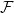
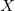

# Well-graded families and the union-closed sets conjecture

This repository contains a set of Python functions for manipulating and analyzing well-graded union-closed families of sets.  When used as a script, the module generates an example of a well-graded union-closed family, , containing a minimal three-set, , where  is -closed and no element of  is abundant (i.e., no element of  appears in at least half of the sets in ).  This family appears [here](https://jmatayoshi.github.io/publications/EJC2020_union_closed_well_graded.pdf) as Example 9.

# Requirements

This module has been tested on Python 3.5.

# Usage

```sh
python uc_well_graded.py [-h] [filename]
```

As a script, the module will generate the example family  and check that it is well-graded and -closed, for  = {1, 2, 3}.  It will then display the number of sets in the family, as well as the frequency with which each element of  appears in .

The script takes a filename as an optional parameter; if given, the example family will be saved to this file.
